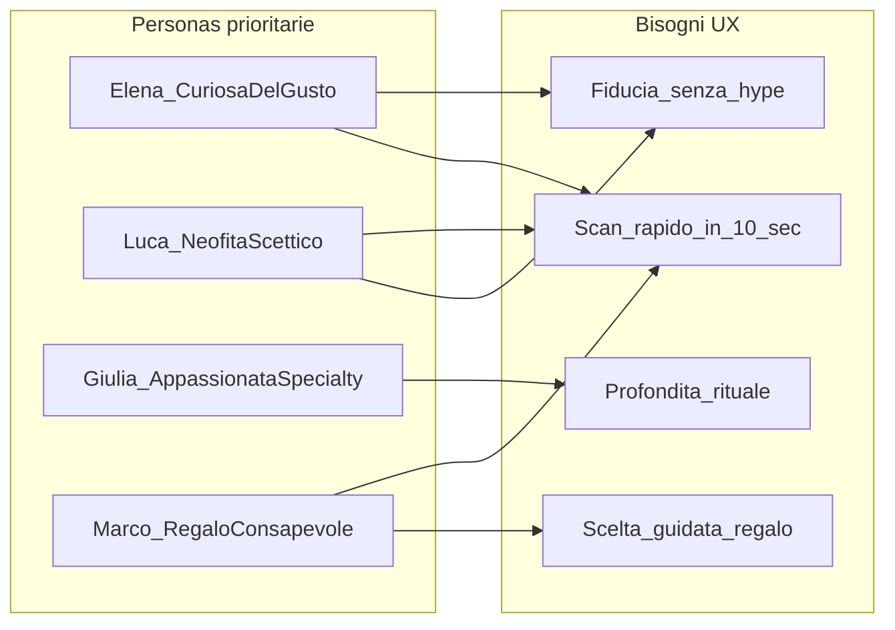
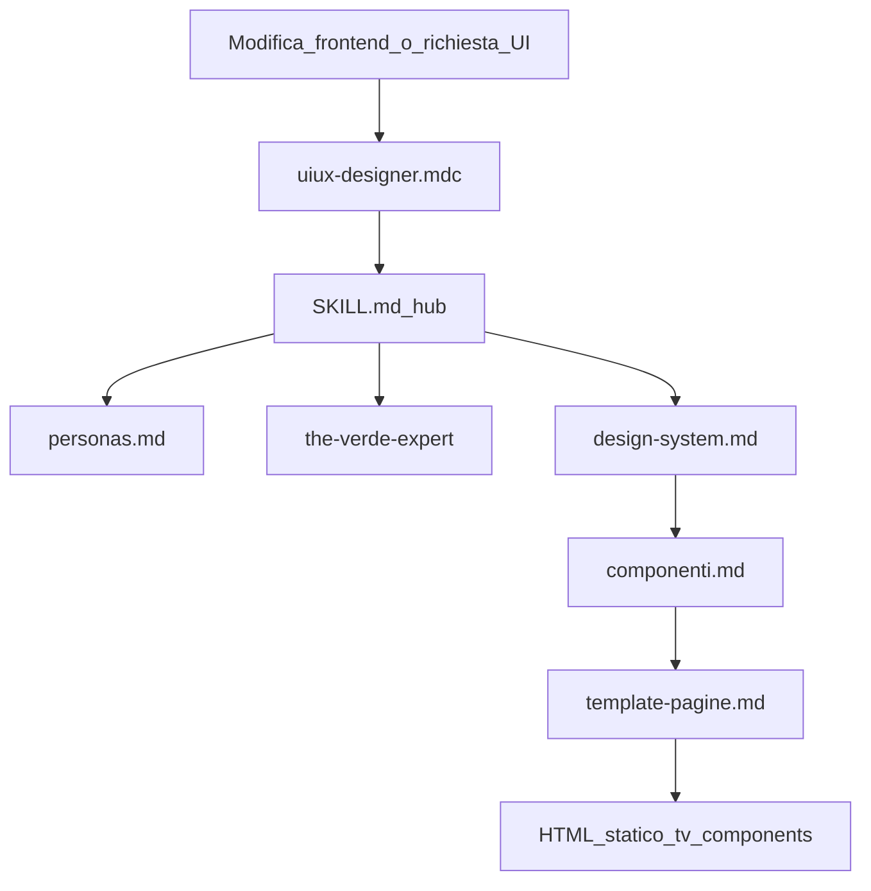

# Agente UI/UX Designer per The Verde

## Contesto

Il progetto [`/var/www/the-verde.it`](/var/www/the-verde.it) oggi contiene solo la skill editoriale [`the-verde-expert`](/var/www/the-verde.it/.cursor/skills/the-verde-expert/SKILL.md) e [`cultura-italiana.md`](/var/www/the-verde.it/.cursor/skills/the-verde-expert/cultura-italiana.md). **Non esiste ancora frontend né design system.**

Il modello di riferimento è [`/var/www/liberating.it/.cursor/skills/uiux-designer/`](/var/www/liberating.it/.cursor/skills/uiux-designer/) (6 file + regola `.mdc`), adattato al brand The Verde con stack **statico HTML+CSS+JS vanilla**, token **Material 3**, deploy **Cloudflare Pages**.

---

## Analisi: stile grafico e UX dal contenuto esistente

### Posizionamento brand (da `cultura-italiana.md` e `SKILL.md`)

| Pilastro editoriale | Implicazione visiva/UX |
|---------------------|------------------------|
| Ponte culturale (origini + Italia) | Layout pulito, tipografia editoriale; niente clipart "orientale" (bamboo, lanterne, font brush) |
| Educazione specialty | Schede strutturate, dati preparazione in evidenza (°C, g/100ml, secondi), glossario accessibile |
| Esperienza lenta senza moralismo | Spazio bianco generoso, ritmo di lettura calmo, niente urgency banner o countdown |
| Qualità e stagionalità | Fotografia naturale (ceramica, vapore, foglia); hub stagionali in navigazione |
| **Non** detox / **non** sostituto ideologico del caffè | Evitare verde neon wellness, badge "detox", before/after, copy aggressivo |

### Personas UX (da derivare in `personas.md`)

Non esistono personas formali; vanno **inferite** da [`cultura-italiana.md`](/var/www/the-verde.it/.cursor/skills/the-verde-expert/cultura-italiana.md) e dai formati contenuto in `SKILL.md`:



| Persona | Profilo sintetico | Priorità UI |
|---------|-------------------|-------------|
| **Elena** (prioritaria) | 35–45, grande città, palato da vino/olio, cerca qualità | Scheda rapida sensoriale; lessico degustazione; "In Italia" visibile |
| **Luca** | Ha provato bustine scadenti, scettico sul wellness | Tono sobrio; box "miti da sfatare"; niente CTA detox |
| **Giulia** | Conosce sencha/gyokuro, vuole preparazione corretta | Zona Prepara dettagliata; tooltip termini; percorsi guidati |
| **Marco** | Compra regali (Natale, compleanni) | Card set degustazione; hub "Regala il tè" leggero |

Ogni decisione UI nella skill dovrà passare il test: *"Elena capisce in 10 secondi? Luca non si sente venduto un detox? Giulia trova i dati tecnici?"*

### Direzione visiva con Almost Acqua

**PANTONE 13-6006 TCX Almost Aqua** ≈ `#CAD3C1` / `rgb(202, 211, 193)` — verde-giallo pastello, luminosità ~79%.

**Problema:** troppo chiaro per testo e bottoni primari (contrasto WCAG insufficiente).

**Soluzione proposta** (documentata in `design-system.md`):

| Ruolo token | Colore | Uso |
|-------------|--------|-----|
| `--tv-color-almost-acqua` | `#CAD3C1` | Brand wash, hero background, primary-container, chip soft |
| `--md-sys-color-primary` | `#3E5C4E` | CTA, link, focus — verde foglia scuro derivato dalla famiglia Green-Yellow Pantone |
| `--md-sys-color-secondary` | `#5A6B55` | Meta, chip secondari |
| `--md-sys-color-surface` | `#FAFAF7` | Sfondo caldo carta |
| `--md-sys-color-on-surface` | `#1C1F1D` | Testo corpo |
| `--tv-font-serif` | `"Fraunces"` o `"Source Serif 4"` self-hosted | Titoli editoriali (raffinatezza magazine gastronomico) |
| Sans system stack | `system-ui` | UI, body, schede tecniche |

Estetica: **editoriale gastronomico italiano** (aria, serif misurato) + **minimalismo funzionale** (no decorazioni zen kitsch, no estetica integratore).

---

## Architettura della skill (hub-and-spoke)

Replicare il pattern liberating con prefisso componenti **`tv-*`** (The Verde) al posto di `ls-*`:

```
.cursor/
├── rules/
│   └── uiux-designer.mdc          ← attivazione su file frontend
└── skills/
    └── uiux-designer/
        ├── SKILL.md               ← hub: workflow, principi, checklist
        ├── personas.md            ← NUOVO: 4 personas + matrice UI
        ├── design-system.md       ← token M3 + Almost Acqua
        ├── componenti.md          ← libreria tv-*
        ├── template-pagine.md     ← wireframe per tipo pagina
        ├── mapping-contenuti.md   ← MD → HTML (formati da the-verde-expert)
        └── cloudflare-pages.md    ← repo site separato, deploy
```

### [`SKILL.md`](.cursor/skills/uiux-designer/SKILL.md) — contenuti chiave

- **Frontmatter** `name: uiux-designer` con description che triggera su frontend, wireframe, CSS, deploy the-verde.it
- **Prima di progettare**: leggere obbligatoriamente [`the-verde-expert/SKILL.md`](/var/www/the-verde.it/.cursor/skills/the-verde-expert/SKILL.md), [`cultura-italiana.md`](/var/www/the-verde.it/.cursor/skills/the-verde-expert/cultura-italiana.md), [`personas.md`](.cursor/skills/uiux-designer/personas.md)
- **Principi UX The Verde** (tabella principio → implicazione):

| Principio | Implicazione UI |
|-----------|-----------------|
| Raffinato, non pedante | Tipografia leggibile; una CTA primaria per pagina |
| Rispetto origini | Chip per paese/tradizione; mai iconografia generica "Asia" |
| Radicamento italiano | Box "In Italia" sempre in scheda varietà; abbinamenti in evidenza |
| No wellness clickbait | Niente badge detox; colori sobri; disclaimer salute sobrio se serve |
| Specialty educativo | Dati preparazione above-the-fold nella zona Cap |

- **Modello scheda a 3 zone** (adattamento del Cap/Fare/Naviga di liberating):

```
Scopri  → breadcrumb, In breve, scheda rapida (origine, profilo, °C, g), chip (paese, stile)
Prepara → Attrezzatura, passaggi numerati, errori comuni
Approfondisci → In Italia, abbinamenti, FAQ, varietà simili, percorso guidato, stagionalità
```

- **Tipi di pagina** mappati ai formati editoriali esistenti:

| Tipo | Sorgente contenuto | Template |
|------|-------------------|----------|
| Home | manifesto brand | hero Almost Acqua + percorsi per persona |
| Catalogo varietà | future `content/varietà/` | filtri paese, caffeina, stagione |
| Scheda varietà | formato "Scheda varietà" in SKILL.md | modello 3 zone |
| Articolo | formato "Articolo per the-verde.it" | colonna 72ch + "In sintesi" |
| Hub origine | Giappone, Cina, Taiwan… | griglia card |
| Hub momento | colazione, pausa, dopo cena | da cultura-italiana |
| Hub stagione | primavera–inverno | card stagionali |
| Legale | privacy/termini | layout minimale |

- **Workflow 9 step** (come liberating): architettura → tipo pagina → design system → componenti → microcopy (the-verde-expert) → SEO → responsive/a11y → redirects → preview CF
- **Integrazione skill**: `the-verde-expert` per microcopy e tono; futura skill SEO se aggiunta
- **Cosa NON fare**: Bootstrap/Tailwind, SPA router, emoji negli heading, estetica zen kitsch, verde neon detox, multi-CTA competitive

### [`personas.md`](.cursor/skills/uiux-designer/personas.md)

- 4 personas con nome, età, contesto, obiettivo, frustrazioni, scenari d'uso
- **Matrice persona × componente** (es. Elena → QuickInfoTable; Giulia → StepList preparazione; Marco → CtaBlock regalo)
- **Modulazione UI** (pattern da stiliattaccamento): stessa pagina, enfasi diversa per sezione senza pagine separate per persona
- Test di validazione UX per ogni nuovo layout

### [`design-system.md`](.cursor/skills/uiux-designer/design-system.md)

- Filosofia visiva Almost Acqua + verde foglia scuro
- Blocco `tokens.css` completo con prefisso `--tv-*` per estensioni brand
- Tipografia, spacing, breakpoint (`sm/md/lg`), zone scheda
- Stati interattivi WCAG AA (focus-visible, contrasto verificato su primary `#3E5C4E`)
- Dark scheme opzionale `prefers-color-scheme`
- Anti-pattern visivi (stock meditation, bamboo SVG, gradient wellness)
- Riferimento fotografico: luce naturale, texture ceramica/tè, no modelli in posa yoga

### [`componenti.md`](.cursor/skills/uiux-designer/componenti.md)

Libreria `tv-*` speculare a liberating, con adattamenti tea-specific:

| Componente | Note The Verde |
|------------|----------------|
| `tv-header` | Nav: Varietà, Per momento, Stagioni, Guide |
| `tv-brew-card` | Scheda rapida °C / g/100ml / secondi / infusioni |
| `tv-sensory-profile` | Aspetto, aroma, gusto, retrogusto |
| `tv-italy-box` | Box "In Italia" (abbinamenti, dove trovarlo) |
| `tv-origin-chips` | Paese + stile (sencha, matcha…) cliccabili |
| `tv-step-list` | Passaggi preparazione con badge tempo |
| `tv-season-banner` | Hub stagionalità |
| `tv-variety-card` | Card catalogo con profilo sintetico |
| `tv-filter-bar` | Filtri facet catalogo |
| + header, breadcrumb, FAQ accordion, path-nav, footer | come liberating |

### [`template-pagine.md`](.cursor/skills/uiux-designer/template-pagine.md)

- Struttura HTML comune (`lang="it"`, link a `tokens.css`, `base.css`, `components.css`)
- Wireframe ASCII + HTML per: Home, Catalogo, Scheda varietà, Hub origine, Hub momento, Articolo, Legale
- Home hero con sfondo `--tv-color-almost-acqua` e CTA "Esplora le varietà" (non "Inizia il detox")

### [`mapping-contenuti.md`](.cursor/skills/uiux-designer/mapping-contenuti.md)

- Pipeline MD → HTML per i formati già definiti in `the-verde-expert/SKILL.md`
- Frontmatter YAML proposto: `title`, `slug`, `origin`, `style`, `caffeine`, `season`, `brew_temp`, `brew_grams`, `brew_seconds`
- Sezioni MD → componenti `tv-*`
- `varieties/index.json` per catalogo filtrabile
- `PATH_ORDER` percorso guidato neofiti: bancha → sencha → gyokuro → matcha (da definire in skill)

### [`cloudflare-pages.md`](.cursor/skills/uiux-designer/cloudflare-pages.md)

- Repo site separato (es. `the-verde-it-site`)
- Sync content: submodule / GitHub Actions / export manuale
- `_headers`, `_redirects`, workflow deploy
- Adattato da [`liberating.it/.../cloudflare-pages.md`](/var/www/liberating.it/.cursor/skills/uiux-designer/cloudflare-pages.md)

### [`.cursor/rules/uiux-designer.mdc`](.cursor/rules/uiux-designer.mdc)

- `alwaysApply: false`
- Globs: `**/the-verde-it-site/**`, `assets/css/**`, `site/**/*.html`, ecc.
- Punta a `skills/uiux-designer/SKILL.md`
- Regola conflitto: accessibilità > decorazione; tono the-verde-expert > copy marketing

---

## Diagramma flusso agente



---

## File da creare (7 skill + 1 rule)

Nessuna modifica a `the-verde-expert` (resta la fonte editoriale); la nuova skill la referenzia.

| File | Azione |
|------|--------|
| `.cursor/skills/uiux-designer/SKILL.md` | Creare |
| `.cursor/skills/uiux-designer/personas.md` | Creare |
| `.cursor/skills/uiux-designer/design-system.md` | Creare |
| `.cursor/skills/uiux-designer/componenti.md` | Creare |
| `.cursor/skills/uiux-designer/template-pagine.md` | Creare |
| `.cursor/skills/uiux-designer/mapping-contenuti.md` | Creare |
| `.cursor/skills/uiux-designer/cloudflare-pages.md` | Creare |
| `.cursor/rules/uiux-designer.mdc` | Creare |

**Non incluso in questo step** (futuro): `public/assets/css/tokens.css` reale, repo `the-verde-it-site`, contenuti `content/`. La skill documenterà i path target senza generare il sito.

---

## Criteri di successo

- Agente invocabile con la stessa ergonomia di liberating.it
- Personas coerenti con `cultura-italiana.md`, non inventate a caso
- Palette Almost Acqua come identità visiva con accessibilità risolta
- Componenti e template allineati ai formati articolo/scheda varietà già in `the-verde-expert`
- Nessun conflitto con la regola always-on `the-verde-expert.mdc` (UI skill attivata solo su file frontend)
