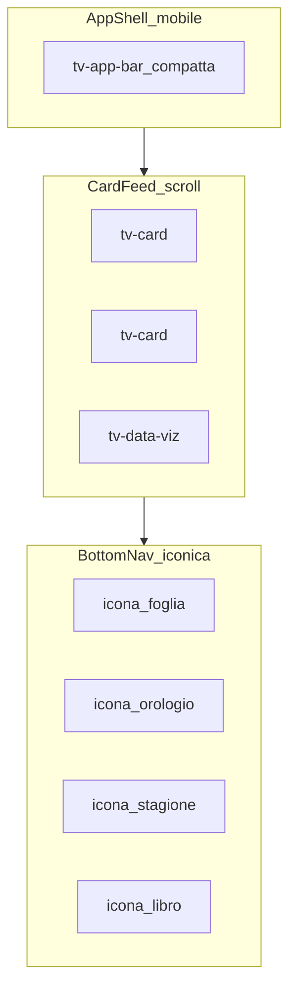
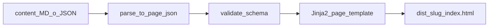

# Arricchimento competenze UI/UX — esperienza web-app mobile-first

## Contesto

La skill esiste già in [`.cursor/skills/uiux-designer/`](.cursor/skills/uiux-designer/) (7 file + regola). Oggi descrive un **sito statico editoriale**: colonna 72ch, nav testuale, sidebar catalogo solo desktop, icone SVG minimali opzionali, nessun chart.

Le nuove richieste spostano il paradigma verso:

| Da (attuale) | A (target) |
|--------------|------------|
| Sito / wiki | **Web-app** (shell persistente, card feed, gesture-friendly) |
| Responsive con enhancement desktop | **Mobile-first** come vincolo di design primario |
| Sezioni H2 + prose | **Schede** impilate, navigabili a scroll |
| Nav testuale + breadcrumb | **Icone e simboli** come affordance principale |
| `tv-brew-card` / liste | **Tabelle** per dati analitici + **d3.js** quando semplifica la lettura |
| Utente legge pareti di testo | Agente **progetta la forma** più efficace per ogni dato |
| Rendering ad hoc per pagina | **Template JSON→HTML** uniformi; prosa e metadati schema.org coerenti |

**Vincolo da preservare:** stack statico HTML per URL indicizzabili (SEO), no SPA router — l’“app feel” si ottiene con **app shell condivisa**, non con client-side routing.

**Nuovo vincolo (iterazione):** il build non deve “inventare” HTML per ogni pagina — passa da un **modello JSON intermedio** renderizzato con **template di pagina fissi**, con regole uniche per grassetti/corsivi/quote e con **microdata / JSON-LD allineati alla struttura semantica** del contenuto.



---

## File da creare (4 nuovi companion)

### 1. [`app-shell.md`](.cursor/skills/uiux-designer/app-shell.md)

Documento centrale per il paradigma web-app mobile-first.

**Contenuti:**
- **Filosofia:** “scroll feed di schede”, non pagina documento; ogni blocco informativo = una `tv-card` autonoma con titolo icona + corpo compatto
- **App shell** (presente su ogni pagina):
  - `tv-app-bar` — header compatto 56px (logo + azione contestuale, non menu testuale espanso)
  - `tv-bottom-nav` — 4 tab fissi con icona + label corta: Varietà | Momenti | Stagioni | Guide (`position: fixed; bottom: 0; safe-area`)
  - `main.tv-feed` — padding-bottom per bottom nav + `scroll-snap-type: y proximity` opzionale sulle card
- **Mobile-first obbligatorio:** progettare prima a 390px; desktop = feed centrato max 480px (colonna app), non layout wiki a 72ch
- **Thumb zone:** CTA e tab nella metà inferiore; touch target min 44×44px
- **Scroll orizzontale:** `tv-scroll-rail` per chip filtri, percorsi guidati, card correlate (swipe nativo)
- **Riduzione testo:** max 3 righe nel teaser card; dettaglio in expand (`<details>`) o tap su card secondaria
- **Transizioni leggere:** `view-transition-name` opzionale su card tap (progressive enhancement, no blocco senza JS)

### 2. [`icone.md`](.cursor/skills/uiux-designer/icone.md)

Vocabolario iconografico per navigazione guidata da simboli (non clipart zen).

**Contenuti:**
- Sprite SVG self-hosted: `assets/icons/tv-icons.svg` con `<symbol id="tv-icon-*">`
- Setta semantica dominio tè (stroke 1.5px, `currentColor`, 24×24 viewBox):

| Icona | Uso |
|-------|-----|
| `tv-icon-leaf` | Varietà, catalogo |
| `tv-icon-cup` | Preparazione, momenti |
| `tv-icon-thermo` | Temperatura |
| `tv-icon-scale` | Dosaggio g/100ml |
| `tv-icon-timer` | Secondi infusione |
| `tv-icon-map` | Origine geografica |
| `tv-icon-italy` | Box In Italia |
| `tv-icon-nose` / `tv-icon-drop` | Profilo sensoriale aroma/gusto |
| `tv-icon-sun` / `tv-icon-snow` | Stagioni |
| `tv-icon-path` | Percorso guidato |
| `tv-icon-filter` | Filtri catalogo |

- Regole: **ogni sezione card** ha icona nell’header; **ogni tab bottom-nav** ha icona primaria; label testuale sempre presente (accessibilità, non solo icona)
- Componente `tv-icon`: `<svg class="tv-icon" aria-hidden="true"><use href="#tv-icon-leaf"/></svg>`
- Aggiornare anti-pattern: vietati font-icon pack; ammessi SVG sprite coerenti

### 3. [`charts-d3.md`](.cursor/skills/uiux-designer/charts-d3.md)

Standard per dati analitici: tabella default, chart quando aggiunge chiarezza.

**Contenuti:**
- **Libreria:** d3.js v7 self-hosted in `assets/js/vendor/d3.min.js` (no CDN obbligatorio)
- **Modulo:** `assets/js/charts.js` — factory `TvChart.init(container, spec)` con spec JSON da build o `data-chart` attribute
- **Matrice decisione** (l’agente deve applicarla prima di ogni visualizzazione):

| Scenario | Formato primario | Chart d3 se |
|----------|------------------|-------------|
| Parametri 1 varietà (°C, g, sec) | `tv-metric-row` con icone | Mai |
| Confronto 2–4 varietà, 3 parametri | Tabella `tv-data-table` | Barre raggruppate se utente confronta visivamente |
| Confronto 5+ varietà su 1 parametro | Tabella ordinata | Barre orizzontali |
| Profilo sensoriale 4 assi | Lista testuale | Radar **solo** se confronto tra 2 varietà |
| Infusioni multiple (tempi) | Tabella step | Linea a gradini |
| Caffeina / ranking | Tabella | Barre con scala comune |
| Dati stagionali / calendario | Card per stagione | Griglia icone (no chart forzato) |

- **Regola d’oro:** tabella HTML **sempre** presente come fallback (`<table class="tv-data-table">`); chart è enhancement in `<div class="tv-chart" role="img" aria-label="...">` con stessa data in tabella nascosta visivamente o sopra per screen reader
- **Palette chart:** derivata da token Almost Acqua — primary `#3E5C4E`, container `#CAD3C1`, griglia `--md-sys-color-outline-variant`
- **Accessibilità:** `aria-label` descrittivo; no sole informazioni nel colore; numeri in tabella per export/copy
- **Performance:** init chart solo `IntersectionObserver` quando card entra in viewport; destroy su navigate away
- Esempi spec JSON per build: `chart: { type: "bar-grouped", dimensions: ["brew_temp","brew_grams"], series: [...] }`

### 4. [`rendering-json-html.md`](.cursor/skills/uiux-designer/rendering-json-html.md)

Pipeline **uniforme** Markdown/JSON → HTML tramite template. Obiettivo: stessa resa visiva e semantica su ogni pagina, indipendentemente dall’autore del contenuto.

**Flusso build (obbligatorio):**



1. **Parse** — MD frontmatter + body → `PageDocument` JSON tipizzato (uno schema per `variety`, `article`, `hub`, `catalog`)
2. **Validate** — JSON Schema in `schemas/page-variety.json`, ecc.; build fallisce se campi obbligatori o tipi inline mancanti
3. **Render** — solo template Jinja2 in `templates/pages/`; **vietato** concatenare HTML nel build script
4. **Emit** — JSON-LD generato dallo stesso `PageDocument` (single source of truth)

**Template di pagina (repo site):**

| Template | Tipo | Slot fissi |
|----------|------|------------|
| `templates/pages/base.html` | Layout shell | head, app-bar, feed, bottom-nav, scripts |
| `templates/pages/variety.html` | Scheda varietà | cards ordinate: brief, metrics, sensory, steps, italy, faq, related |
| `templates/pages/article.html` | Guida | lead card + card per sezione + summary |
| `templates/pages/hub.html` | Hub origine/momento/stagione | intro card + grid card |
| `templates/pages/catalog.html` | Catalogo | filter rail + card list |
| `templates/partials/card.html` | Partial | header icona + titolo + body |
| `templates/partials/prose.html` | Partial | blocco testo con formattazione uniforme |
| `templates/partials/json-ld.html` | Partial | script da `page.schema` |

Ogni slot riceve **oggetti JSON**, non HTML grezzo — il template decide markup `tv-*`.

**Modello JSON esempio (scheda varietà):**

```json
{
  "type": "variety",
  "slug": "sencha",
  "meta": { "title": "...", "description": "...", "canonical": "..." },
  "schema": {
    "@type": "Article",
    "breadcrumb": [...],
    "howTo": { "steps": [...] },
    "faq": [...]
  },
  "cards": [
    { "id": "brief", "icon": "leaf", "title": "In breve", "body": { "type": "prose", "blocks": [...] } },
    { "id": "brew", "icon": "thermo", "title": "Preparazione", "body": { "type": "metrics", "items": [...] } }
  ]
}
```

**Regole prosa uniformi** (unico renderer `render_prose(blocks)`):

| Input MD / JSON | Output HTML | CSS class | Regola |
|-----------------|-------------|-----------|--------|
| `**testo**` | `<strong class="tv-prose__strong">` | enfasi funzionale | Solo parole chiave, mai paragrafi interi |
| `*testo*` / `_testo_` | `<em class="tv-prose__em">` | termini stranieri, titoli opere | Nomi varietà al primo uso possono essere `<em>` |
| `> citazione` | `<blockquote class="tv-prose__quote">` | citazione fonte | Opzionale `<cite>` se fonte in metadata |
| `` `termine` `` | `<abbr class="tv-term" title="...">` | glossario | Title obbligatorio da glossario build |
| Paragrafo | `<p class="tv-prose__p">` | body card | Max 3 frasi in card teaser |
| Lista `-` | `<ul class="tv-prose__list">` | elenchi | Non mischiare con paragrafo nella stessa card senza titolo |
| Link | `<a class="tv-prose__link">` | interni | Trailing slash, `rel` solo esterni |

**Vietato nel renderer:** `<b>`, `<i>` legacy; grassetto su interi `<p>`; stili inline; emoji nel prose.

**Mapping schema.org → HTML** (contenuto **e** metadati organizzati insieme):

| `@type` / sezione JSON | Elemento HTML | Note |
|------------------------|---------------|------|
| `Article` | `<article itemscope itemtype="https://schema.org/Article">` | `itemprop="headline"`, `description`, `author` (The Verde) |
| `BreadcrumbList` | `tv-breadcrumb` con microdata | Già in componenti; generato da `schema.breadcrumb` |
| `HowTo` | `tv-step-list` in card Prepara | Ogni step: `itemprop="step"`, `HowToStep`, `text`, opzionale `duration` |
| `FAQPage` | `tv-faq` | Ogni `<details>`: `Question` / `Answer`; JSON-LD speculare |
| `NutritionInformation` | solo se dati reali in JSON | Non inventare per hype wellness |
| Metriche preparazione | `itemprop` su `tv-metric-row` dove applicabile | Es. temperatura come proprietà custom in `additionalProperty` |

**Regola:** JSON-LD in `<script type="application/ld+json">` deve essere **generato automaticamente** dal `PageDocument.schema` — mai scritto a mano nel template né duplicato con valori diversi dal microdata visibile.

**Checklist uniformità rendering:**

- [ ] Ogni tipo pagina usa un solo template Jinja2
- [ ] Prose passa sempre da `partials/prose.html`
- [ ] Grassetti/corsivi/quote rispettano tabella sopra su tutte le pagine
- [ ] `PageDocument` validato contro JSON Schema prima del render
- [ ] Microdata HTML e JSON-LD derivano dallo stesso oggetto `schema`
- [ ] Due schede varietà con stessi campi → stessa struttura DOM (solo contenuto cambia)

---

## File da aggiornare (7 esistenti + 1 rule)

### [`SKILL.md`](.cursor/skills/uiux-designer/SKILL.md)

- Aggiornare description: web-app mobile-first, card feed, d3 charts
- Aggiungere tabella progressive disclosure per `app-shell.md`, `icone.md`, `charts-d3.md`, `rendering-json-html.md`
- Nuovi principi UX in cima:

| Principio | Implicazione |
|-----------|--------------|
| Web-app, non wiki | Card feed; shell con bottom nav; niente pareti di testo |
| Mobile-first | Design 390px prima; desktop = colonna app centrata |
| Icone guidano | Ogni sezione/tab/azione chiave ha simbolo + label |
| Dati leggibili | Tabella default; chart d3 solo se matrice in charts-d3.md lo consiglia |
| Fatica del designer | Per ogni blocco dati: chiedersi “card, tabella o chart?” prima di scrivere HTML |
| Rendering uniforme | Solo template + JSON intermedio; prosa e schema.org da regole uniche |

- Riscrivere “Tre obiettivi operativi” verso scroll card e navigazione iconica
- Aggiornare “Cosa NON fare”: rimuovere implicito wiki; aggiungere “layout articolo a colonna unica lunga”, “nav solo testuale senza icone”, “chart senza tabella fallback”
- Workflow: +step “Scegliere formato dato (charts-d3.md)”, “Verificare shell mobile (app-shell.md)”, “Validare PageDocument e template (rendering-json-html.md)”
- Checklist: bottom nav, touch 44px, tabella fallback chart, icone sezioni, prose uniforme, JSON-LD = microdata

### [`design-system.md`](.cursor/skills/uiux-designer/design-system.md)

- Nuova sezione **Mobile-first tokens:**
  - `--tv-bottom-nav-height: 64px`
  - `--tv-app-bar-height: 56px`
  - `--tv-feed-gap: 12px`
  - `--tv-card-radius: 16px`
  - `--tv-feed-max-width: 480px` (colonna app desktop)
  - `--tv-safe-bottom: env(safe-area-inset-bottom)`
- Layout: sostituire diagramma “pagina wiki” con `tv-feed` + bottom nav
- Token chart: `--tv-chart-primary`, `--tv-chart-grid`, `--tv-chart-label`
- Tipografia mobile: body min 16px; titoli card `title-medium` non `headline-large` su mobile
- Sezione **Prosa** (classi `tv-prose__*`): stili per `strong`, `em`, `blockquote`, `cite`, link — unica fonte per grassetti/corsivi/quote

### [`componenti.md`](.cursor/skills/uiux-designer/componenti.md)

**Nuovi componenti:**

| Componente | Ruolo |
|------------|-------|
| `tv-app-bar` | Header compatto sostituisce/envelope `tv-header` su mobile |
| `tv-bottom-nav` | Tab bar iconica 4 voci |
| `tv-feed` | Contenitore verticale card stack |
| `tv-card` | Scheda generica (header icona + titolo + body + footer opzionale) |
| `tv-metric-row` | 3–4 metriche inline con icone (°C, g, sec) |
| `tv-data-table` | Tabella responsive scrollabile orizzontalmente |
| `tv-chart` | Wrapper d3 con fallback tabella |
| `tv-scroll-rail` | Row orizzontale swipe (filtri, correlati) |
| `tv-icon` | SVG sprite use |
| `tv-section-header` | Icona + titolo sezione nel feed |

**Refactor componenti esistenti:**
- `tv-brew-card` → spesso `tv-metric-row` dentro `tv-card` con icona thermo/scale/timer
- `tv-sensory-profile` → `tv-card` con sotto-card o tabella 4 righe
- `tv-header` → desktop/tablet opzionale; mobile usa `tv-app-bar` + `tv-bottom-nav`
- `tv-mininav` → icon tabs orizzontali sticky sotto app-bar (Panoramica | Prepara | Approfondisci)

### [`template-pagine.md`](.cursor/skills/uiux-designer/template-pagine.md)

Riscrivere wireframe principali:

**Scheda varietà (modello card feed):**
```
tv-app-bar [back] Sencha
tv-scroll-rail [icon tabs: Scopri | Prepara | Approfondisci]
--- feed ---
tv-card: In breve
tv-card: tv-metric-row (brew)
tv-card: profilo sensoriale (tabella o mini radar)
tv-card: passaggi (tv-step-list)
tv-card: In Italia (icona italy)
tv-card: FAQ
tv-scroll-rail: varietà simili
tv-bottom-nav
```

**Home:** griglia 2×2 `tv-card` entry point con icone grandi (non hero testuale lungo)

**Catalogo:** filtri in `tv-scroll-rail`; lista verticale `tv-variety-card` full-width

**Articolo:** spezzare in card per sezione H2 (non colonna wiki continua); “In sintesi” = ultima card evidenziata

### [`personas.md`](.cursor/skills/uiux-designer/personas.md)

- Aggiornare test validazione:
  - [ ] Navigazione possibile con una mano (bottom nav + thumb)?
  - [ ] Informazione chiave in prima card senza scroll?
  - [ ] Icone riconoscibili con label?
  - [ ] Dati comparativi: tabella leggibile su 390px?
- Matrice persona × componente: aggiungere `tv-bottom-nav`, `tv-chart`, `tv-metric-row`

### [`mapping-contenuti.md`](.cursor/skills/uiux-designer/mapping-contenuti.md)

Ridurre a **indice operativo** che punta a [`rendering-json-html.md`](.cursor/skills/uiux-designer/rendering-json-html.md) per il dettaglio pipeline.

- Flusso: MD → `PageDocument` JSON → template Jinja2 (non HTML inline nel parser)
- Definire JSON Schema per `variety`, `article`, `hub` in `schemas/`
- Mappa sezioni MD → chiavi JSON → slot template (es. `## In Italia` → `cards[].id = "italy"`)
- Frontmatter + body → `meta` + `schema` + `cards[]`
- `chart:` nel JSON card body → partial chart + tabella
- FAQ MD → `schema.faq[]` + card `tv-faq` (stessa struttura per microdata e JSON-LD)
- Passaggi MD → `schema.howTo.steps[]` + `tv-step-list`
- Glossario termini → lookup per `<abbr class="tv-term">` nel renderer prose

### [`cloudflare-pages.md`](.cursor/skills/uiux-designer/cloudflare-pages.md)

- Aggiungere a struttura repo:
  - `assets/js/vendor/d3.min.js`
  - `assets/js/charts.js`
  - `assets/icons/tv-icons.svg`
  - `templates/pages/` e `templates/partials/` (Jinja2)
  - `schemas/page-*.json` (JSON Schema)
  - `scripts/render_prose.py` o modulo condiviso parse → prose blocks
- CSP: `script-src 'self'` include vendor
- Checklist deploy: chart fallback senza JS, bottom nav su tutte le pagine principali

### [`uiux-designer.mdc`](.cursor/rules/uiux-designer.mdc)

- Aggiornare description e “Cosa fare sempre”: app shell mobile, icone, d3 con fallback tabella
- Elencare i 4 nuovi companion file in “Prima di implementare”
- Aggiungere: template Jinja2 obbligatori; niente HTML ad hoc nel build

---

## Coerenza con vincoli esistenti

| Vincolo brand (invariato) | Come si applica nel nuovo paradigma |
|---------------------------|-------------------------------------|
| Almost Acqua + primary scuro | Token chart e card wash |
| No zen kitsch | Icone lineari geometriche, non illustrazioni |
| No detox / wellness neon | Metriche sobrie, niente gauge “salute” |
| the-verde-expert tono | Testi dentro card brevi |
| SEO statico | Ogni URL = HTML completo; d3 è enhancement |
| WCAG AA | Tabella fallback, label icone, contrasto chart |
| Schema.org | Article, HowTo, FAQPage, BreadcrumbList da PageDocument unico |
| Uniformità | Template + prose renderer; stesso DOM per stesso tipo contenuto |

---

## Ordine di implementazione consigliato

1. Creare `app-shell.md`, `icone.md`, `charts-d3.md`, `rendering-json-html.md`
2. Aggiornare `SKILL.md` (hub + link) e `design-system.md` (token mobile + prosa)
3. Aggiornare `componenti.md` e `template-pagine.md` (allineati agli slot template Jinja2)
4. Riscrivere `mapping-contenuti.md` come indice verso rendering JSON; aggiornare `personas.md`, `cloudflare-pages.md`, `uiux-designer.mdc`

Nessuna modifica a `the-verde-expert`.
