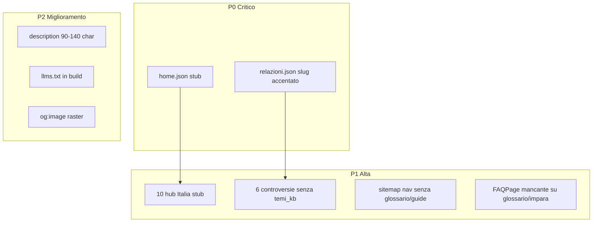

# Audit SEO/GEO — the-verde.it

## Sintesi esecutiva


| Area                                       | Stato    | Note                                                                                                                                                                  |
| ------------------------------------------ | -------- | --------------------------------------------------------------------------------------------------------------------------------------------------------------------- |
| Meta tecnici (canonical, robots, hreflang) | Buono    | 0 canonical vuoti; template `[templates/base.html](templates/base.html)` completo                                                                                     |
| Title unici / no duplicate                 | Buono    | 0 title duplicati su 73 JSON                                                                                                                                          |
| Description length                         | Critico  | 0 oltre 160 char; **51/73 sotto 70 char**                                                                                                                             |
| Internal linking                           | Debole   | **61/73** con `related_slugs: []`; hub Italia senza `explore_next`                                                                                                    |
| Schema.org build                           | Parziale | Auto in `[page_document.py](scripts/site_builder/page_document.py)` / `[seo_context.py](scripts/site_builder/enrichers/seo_context.py)`; **FAQPage solo per varietà** |
| GEO (citabilità LLM)                       | Debole   | Home vuota; hub Italia stub; nessun `llms.txt`                                                                                                                        |
| Grafo temi                                 | Rotto    | Slug controversia con accento in `[content/relazioni.json](content/relazioni.json)` vs ASCII nel filesystem                                                           |





---

## P0 — Criticità immediate

### 1. Home page: landing SEO/GEO assente

**File:** `[content/pagine/home.json](content/pagine/home.json)`


| Campo              | Attuale           | Problema                            |
| ------------------ | ----------------- | ----------------------------------- |
| `meta.title`       | `"Home"`          | Generico, zero keyword              |
| `meta.description` | `"Home"` (4 char) | Snippet inutilizzabile              |
| `body.blocks`      | `[]`              | Nessun chunk citabile per LLM       |
| `navigation`       | tutto vuoto       | Nessun hub verso sezioni principali |


**Interventi SEO:**

- Title: es. `The Verde — cultura del tè verde in Italia` (≤60 char)
- Description: 120–155 char con intento + CTA implicita
- `og_type`: `website` (non `article`)

**Interventi GEO:**

- Blocchi `prose` answer-first: cos'è The Verde, cos'è il tè verde, perché per l'Italia
- `navigation.explore_next`: link a `/varieta/`, `/impara/`, `/glossario/`, `/italia/`
- `navigation.temi_kb`: ancoraggio al grafo KB

**Agente:** the-verde-expert (contenuto) + web-architect (validazione schema `page`)

---

### 2. Slug controversia disallineato nel grafo

**Problema:** `[content/relazioni.json](content/relazioni.json)` referenzia `qualità-sensoriale-vs-chimica` (con accento) ma il file reale è `[content/impara/controversie/qualita-sensoriale-vs-chimica.json](content/impara/controversie/qualita-sensoriale-vs-chimica.json)`.

**Impatto:**

- `navigation.controversie` negli hub impara (`lavorazione.json`, `degustazione.json`) non risolve il link
- Backfill `explore_next` in `[navigation.py](scripts/site_builder/enrichers/navigation.py)` L82–92 fallisce
- Temi `lavorazione_qualità` / `degustazione_sensoriale` non collegano la controversia

**Intervento:** Allineare tutti i riferimenti a `qualita-sensoriale-vs-chimica` (ASCII, coerente con URL canonico).

---

## P1 — Alta priorità

### 3. Hub Italia: sezione più debole (10 file)

**File:** `content/italia/**/*.json` — esempio `[content/italia/stagioni/autunno.json](content/italia/stagioni/autunno.json)`


| Problema          | Dettaglio                                              |
| ----------------- | ------------------------------------------------------ |
| Meta stub         | `description` 13–53 char (`"Note tostate."`)           |
| Body stub         | Un paragrafo = tagline, non citabile                   |
| Navigazione       | `related_slugs: []`, `explore_next: []`, `temi_kb: []` |
| Long-tail assente | Title generici (`"Autunno"`, `"Estate"`)               |


**Interventi SEO (per ogni hub):**

- Title long-tail: es. `Tè verde in autunno — varietà tostate per l'Italia`
- Description 100–140 char con varietà consigliate (hojicha, genmaicha…)
- `meta.keywords`: stagione + varietà + abbinamento IT

**Interventi GEO:**

- 2+ paragrafi autonomi: cosa bere, perché in Italia, temperatura/stagione
- `explore_next` ≥3: varietà stagionali + hub sorelle + `/italia/abbinamenti/`
- `temi_kb` da mappare in relazioni (nuovo tema o collegamento esistente)

**Priorità file:** `italia/index.json` → `abbinamenti.json` → 4 stagioni → 4 momenti

---

### 4. Controversie: `temi_kb` vuoto (6/6)

**File:** `content/impara/controversie/*.json` — es. `[qualita-sensoriale-vs-chimica.json](content/impara/controversie/qualita-sensoriale-vs-chimica.json)`


| File                                 | `temi_kb` da impostare                           |
| ------------------------------------ | ------------------------------------------------ |
| `bevanda-vs-integratore.json`        | `salute_catechine`, `cucina_usi_pratici`         |
| `caffeina-stimolazione.json`         | `caffeina_tannini`                               |
| `cerimonia-cina-vs-giappone.json`    | `storia_cultura`, `cerimonia_spiritualita`       |
| `consumo-quotidiano-vs-rituale.json` | idem                                             |
| `salute-scienza-vs-tradizione.json`  | `salute_catechine`                               |
| `qualita-sensoriale-vs-chimica.json` | `lavorazione_qualità`, `degustazione_sensoriale` |


**GEO:** Le controversie con blocco `positions` sono già forti per citabilità LLM — manca solo il collegamento al grafo temi.

---

### 5. Glossario: linking interno sotto soglia (32 file)

**Stato:** Tutti con `related_slugs: []`; molti con solo 1 link in `explore_next` (soglia skill: ≥2–3).

**Interventi:**

- `related_slugs`: termini correlati (es. `matcha` → `tencha`, `chasen`, `koicha`)
- `explore_next` ≥2: varietà + hub impara
- Espandere description sotto-70-char (31/32 glossario) verso 80–120 char con definizione diretta

**Rischio cannibalizzazione:** `[content/glossario/matcha.json](content/glossario/matcha.json)` title `"Matcha"` vs `[content/varieta/matcha.json](content/varieta/matcha.json)` — differenziare title glossario: `Matcha — definizione e usi`

---

### 6. Navigazione primaria incompleta

**File:** `[content/_config/sitemap.json](content/_config/sitemap.json)`


| Gap                            | Impatto SEO/GEO                          |
| ------------------------------ | ---------------------------------------- |
| `/glossario/` assente da `nav` | 32 DefinedTerm meno scopribili           |
| `/guide/` assente da `nav`     | 2 guide long-tail isolate                |
| `social.same_as: []`           | Organization schema senza E-E-A-T social |


**Intervento:** Aggiungere voci nav (valutare impatto UX con uiux-designer); popolare `same_as` quando profili social esistono.

---

### 7. FAQPage JSON-LD mancante fuori dalle varietà

**Evidenza:** In `[page_document.py](scripts/site_builder/page_document.py)` L400–412, `faq_schema` è emesso **solo** per `page_type == "variety"`. Stesso in `[seo_context.py](scripts/site_builder/enrichers/seo_context.py)` L122–124.

**Contenuto con blocchi `faq` ma senza FAQPage:** ~15 file in impara, glossario, guide (grep `"type": "faq"`).

**Intervento build (web-architect):**

- Estrarre FAQ da `body.blocks` (come già fatto per varietà via cards) anche per `article`, `glossary`, `controversy`
- Aggiungere `FAQPage` supplementare al `@graph`
- Test in `[tests/test_enrichers_seo.py](tests/test_enrichers_seo.py)`

---

### 8. Assenza `llms.txt` (GEO)

**Stato:** File non presente in repo né in build (`[builder.py](scripts/site_builder/builder.py)` non lo genera).

**Intervento:** Generare `dist/llms.txt` in build con hub principali, formato contenuti, lingua, sezioni chiave — template in `[.cursor/skills/seo-geo-expert/geo-optimization.md](.cursor/skills/seo-geo-expert/geo-optimization.md)`.

---

## P2 — Miglioramenti consigliati

### 9. Meta description troppo corte (51 pagine)

**Buoni esempi (70+ char):** `impara/preparazione.json`, `guide/matcha-italia.json`, `glossario/catechine.json`

**Da espandere:** varietà (es. gyokuro 54 char), glossario stub, hub italia

**Regola:** 90–140 char, risposta diretta + contesto Italia dove pertinente.

---

### 10. Keyword duplicate (9 varietà)

Duplicati in `meta.keywords` (es. gyokuro ×2 in `[content/varieta/gyokuro.json](content/varieta/gyokuro.json)`). Sostituire con long-tail: `ombra`, `umami`, `Uji`.

---

### 11. `path_order` incompleto

`[sitemap.json](content/_config/sitemap.json)` e `[navigation.py](scripts/site_builder/enrichers/navigation.py)` L7: solo 4 varietà pedagogiche. Le altre 8 varietà non hanno `path_nav` prev/next.

**Intervento:** Estendere `PATH_ORDER` o accettare navigazione solo per le 4 «pilastro».

---

### 12. OG image SVG

`[og_image](content/_config/sitemap.json)`: `/assets/images/og-default.svg` — alcune piattaforme social preferiscono raster (PNG/JPG 1200×630). Valutare export PNG per share migliore.

---

### 13. Primo paragrafo GEO (answer-first)

Pattern poetico ok editorialmente, ma alcuni intro ritardano la definizione:

- Varietà gyokuro, glossario strumenti (`chawan`, `wok`)
- Hub italia (solo tagline)

**Intervento:** Aggiungere frase definitoria come primo span del primo paragrafo, poi tono evocativo.

---

## Cosa funziona già (non toccare senza motivo)

- **Varietà (12/12):** `related_slugs`, `temi_kb`, `explore_next` popolati; HowTo + FAQPage da build
- **Template head:** canonical, hreflang, OG, Twitter, JSON-LD multi-blocco
- **Robots/sitemap:** generati in build; `Disallow: /diario/nuova/`
- **Hub impara principali:** description 90–110 char, intro GEO-solido (`preparazione`, `salute`, `caffeina`)
- **Controversie:** blocco `positions` con fonti — ottimo per GEO
- **Test SEO:** `[tests/test_enrichers_seo.py](tests/test_enrichers_seo.py)`, `[tests/test_build_integration.py](tests/test_build_integration.py)`

---

## Piano di implementazione (fasi)

### Fase 1 — P0 (1–2 sessioni)

1. Riscrivere `[content/pagine/home.json](content/pagine/home.json)` (the-verde-expert + seo-geo-expert)
2. Fix slug in `[content/relazioni.json](content/relazioni.json)` + `navigation.controversie` negli hub impara
3. `pytest` + build di verifica

### Fase 2 — P1 contenuti (2–3 sessioni)

1. Popolare 10 hub Italia (meta + body + navigation)
2. `temi_kb` su 6 controversie + `related_slugs` dove manca
3. Glossario: batch `related_slugs` + description espansa (top 10 termini per traffico)

### Fase 3 — P1 infrastruttura (1 sessione)

1. FAQPage da blocchi `faq` in build (`[page_document.py](scripts/site_builder/page_document.py)`)
2. Generazione `llms.txt` in `[builder.py](scripts/site_builder/builder.py)`
3. Nav glossario/guide in `[sitemap.json](content/_config/sitemap.json)` (con uiux-designer)

### Fase 4 — P2 polish (ongoing)

1. Description batch varietà/glossario
2. Keyword dedup
3. OG image raster
4. Audit live post-deploy via `[agents/seo-geo-expert/](agents/seo-geo-expert/)` endpoint `/audit`

---

## Verifica post-intervento

```bash
pytest tests/test_enrichers_seo.py tests/test_build_integration.py tests/test_schemas.py -q
python3 scripts/build.py --content content --out dist
# Campione: dist/index.html, dist/varieta/gyokuro/index.html, dist/glossario/matcha/index.html
# Controllare: title, description, JSON-LD @graph (FAQPage su impara), llms.txt
```

Metriche target dopo Fase 1–3:

- Home description ≥120 char, body ≥3 blocchi
- 0 slug rotti in relazioni.json
- Hub Italia: description ≥90 char, explore_next ≥3
- FAQPage su pagine con blocco faq
- `llms.txt` in dist/

