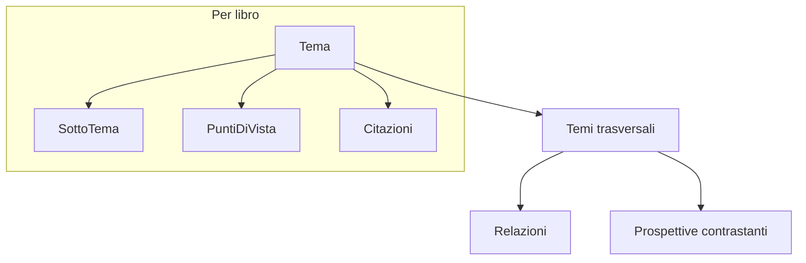

## Knowledge base "the verde"

### Obiettivo
Generare un singolo file JSON in `/var/www/the-verde.it/books/knowledge-base.json` che rappresenti una base di conoscenza originale sul tè verde, costruita leggendo i contenuti reali dei 5 libri (testo gia estraibile, ~280k parole totali) e collegando i temi tra loro.

### Fonti
- `Il libro del tè verde - Diana Rosen.pdf` (IT) - divulgativo: storia, varietà, salute, ricette, bellezza
- `Manuale del sommelier del tè - Victoria Bisogno, Jane Pettigrew.pdf` (IT) - tecnico: degustazione, varietà, servizio
- `Manuale per la preparazione del tè - Davide Pellegrino.pdf` (IT) - pratico: coltivazione, lavorazione, infusione, cerimonie
- `El secreto japones del tè verde - Izumi Foraste Onuma.pdf` (ES) - culturale: Giappone, rituali, benessere
- `Health Benefits of Green Tea - Yukihiko Hara.pdf` (EN) - scientifico: catechine, evidenze, patologie

### Metodo di estrazione
1. Per ogni libro, esportare il testo con `pdftotext` in file temporanei e leggerlo a blocchi (indice/capitoli + campionamento dei contenuti) per identificare temi, sotto-temi, angolo dell'autore, punti di vista e citazioni rappresentative con numero di pagina.
2. Normalizzare i temi in italiano, mappando concetti equivalenti tra ES/EN/IT su un vocabolario canonico condiviso (es. "catechine", "cerimonia", "varietà", "salute").
3. Costruire i collegamenti: temi trasversali, relazioni tipizzate e questioni con posizioni contrastanti.
4. Pulire i file temporanei al termine.

### Struttura del JSON
- `meta`: tema centrale, lingua, data, elenco fonti.
- `libri[]`: per ciascun libro `id`, `titolo`, `autore`, `lingua_originale`, `angolo_principale`, e `temi[]` con `nome`, `descrizione`, `sotto_temi[]` (con `pagine`), `punti_di_vista[]`, `citazioni[]`.
- `temi_trasversali[]`: tema canonico con `descrizione`, `libri_correlati`, `convergenze`, `divergenze`.
- `relazioni[]`: archi `{ da, a, tipo, descrizione }` con `tipo` in `complementa | contrasta | approfondisce | presuppone`.
- `prospettive_contrastanti[]`: `{ questione, posizioni[ { fonte, tesi } ], sintesi }` per dare "tanti angoli diversi" (es. salute: evidenza scientifica vs tradizione; cerimonia: Giappone vs Cina; qualità: sensoriale vs chimica).

### Schema concettuale

### Deliverable
- Un file: `/var/www/the-verde.it/books/knowledge-base.json` (UTF-8, indentato), autoconsistente e validabile.
- Nessuna modifica ai PDF esistenti.

### Note
- Le citazioni saranno tradotte/normalizzate in italiano; dove utile verra indicata la lingua originale della fonte e la pagina.
- Stima dimensione: file ricco ma gestibile (decine di KB), proporzionato all'approccio intermedio scelto.