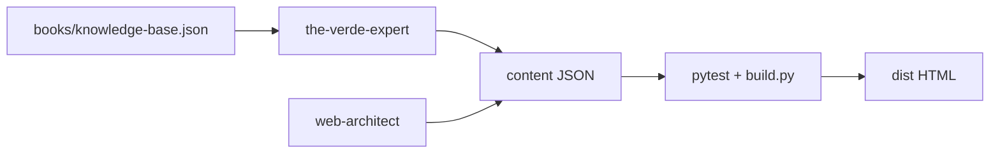
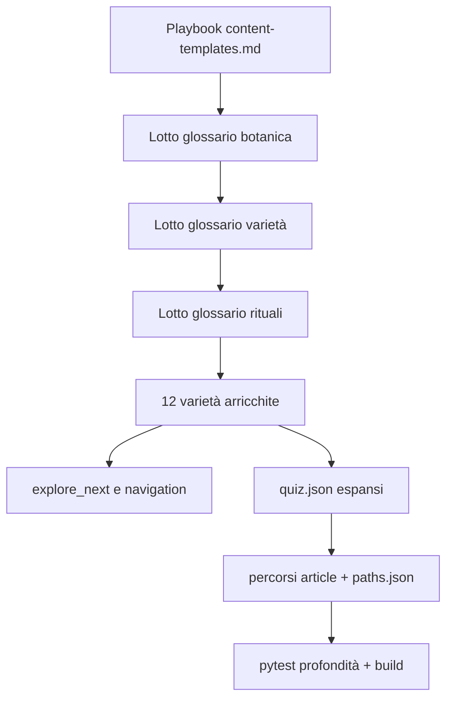

# Popolamento JSON — The Verde Expert

## Stato attuale (gap)

| Area | File | Situazione |
|------|------|------------|
| Glossario | 32 × [`content/glossario/*.json`](content/glossario/) | **Critico**: 2 blocchi ciascuno; 32/32 hanno `deep` placeholder («Consulta le schede…») |
| Varietà | 12 × [`content/varieta/*.json`](content/varieta/) | Struttura OK (~9 blocchi): lead poetico, sensory, brew, FAQ — ma `explore_next` vuoto, `cultivar` spesso vuoto, testo non esaustivo |
| Percorsi | 4 × [`content/gioca/percorsi/*.json`](content/gioca/percorsi/) + [`content/_config/paths.json`](content/_config/paths.json) | Articolo percorso = 1 blocco; micro-quiz minimali (2 opzioni, no `explain`) |
| Quiz | [`content/_config/quizzes.json`](content/_config/quizzes.json) | 5 quiz × 3 domande ciascuno — insufficienti per apprendimento «preciso ed esaustivo» |



## Divisione ruoli

| Agente | Fa | Non fa |
|--------|-----|--------|
| **the-verde-expert** | Scrive/arrichisce JSON editoriali; prosa, accuratezza, fonti; quiz e domande didattiche | Modificare schemi, template, `site_builder/` senza handoff |
| **web-architect** | Validazione schema, `explore_next`/grafo, test profondità contenuto, build CI | Scrivere prosa editoriale |

Handoff obbligatorio: se serve nuovo tipo blocco (es. `sources` dedicato), **web-architect** estende [`content/_schemas/document.base.schema.json`](content/_schemas/document.base.schema.json) e [`scripts/site_builder/blocks.py`](scripts/site_builder/blocks.py); fino ad allora usare blocchi esistenti.

## Fonti — gerarchia

1. **Primaria**: [`books/knowledge-base.json`](books/knowledge-base.json) — sempre consultata per fatti, citazioni, divergenze
2. **Secondaria** (solo se KB insufficiente): Treccani, enciclopedie accademiche, istituzioni (es. definizioni botaniche per `camellia-sinensis`, `umami`, `catechine`)
3. **Piè di pagina** (voice-guide): sezione `Fonti` come `heading` + `list` in fondo al `body`; formato misto:
   - KB: `rosen, p. 181`
   - Esterna: `Treccani — Umami` (testo; link opzionale via span `link` se URL stabile)

Aggiornare [`bibliografia.md`](.cursor/skills/the-verde-expert/bibliografia.md): Treccani ammessa **in nota**, mai come unica fonte senza ancoraggio KB.

## Template JSON per tipo (the-verde-expert)

Creare playbook operativo [`.cursor/skills/the-verde-expert/content-templates.md`](.cursor/skills/the-verde-expert/content-templates.md) con JSON minimi copiabili.

### Glossario — target per voce

Struttura in [`content/_schemas/glossary.schema.json`](content/_schemas/glossary.schema.json) + blocchi da [content-model.md](.cursor/skills/web-architect/content-model.md):

```
level_section intro     → Per iniziare (1 paragrafo, tu, zero gergo)
level_section deep        →
  heading h2              → Etimologia / contesto
  paragraph(s)            → Prosa poetico-evocativa + uso nel tè verde
  list                    → 3–5 punti chiave
  callout variant=italia  → solo se pertinente
  related_links           → 2–4 link interni (varietà, impara, altro glossario)
  faq                     → 1–2 domande frequenti
  heading h2 Fonti
  list                    → KB + Treccani se usato
```

**Criteri di completezza** (per voce):
- Intro ≥ 40 parole; deep ≥ 150 parole testo utile
- Almeno 2 `related_links` interni
- `navigation.temi_kb` popolato (da KB)
- `navigation.explore_next` ≥ 2 voci (web-architect: allineare a [`content/relazioni.json`](content/relazioni.json))

**Cluster tematici** (32 voci, 4 lotti):

| Lotto | Voci | KB / Treccani |
|-------|------|---------------|
| Botanica e chimica | camellia-sinensis, catechine, egcg, l-teanina, astringenza, umami, vapore | KB `hara`, `pellegrino`; Treccani per termini scientifici |
| Varietà e lavorazione | sencha, gyokuro, matcha, bancha, hojicha, genmaicha, kukicha, tencha, shincha, gunpowder, longjing, darjeeling, cold-brew | KB `rosen-lavorazione`, `pellegrino-varietà` |
| Strumenti e rituali | chasen, chawan, kyusu, yunomi, yixing, gaiwan, wok, gong-fu-cha, chanoyu, roji, usucha, koicha | KB `cerimonia_spiritualita`, `onuma` |

### Varietà — target per scheda

Riferimento: [voice-guide.md](.cursor/skills/the-verde-expert/voice-guide.md) + [varietà.md](.cursor/skills/the-verde-expert/varietà.md).

Ordine blocchi in [`content/varieta/*.json`](content/varieta/):

1. `paragraph` — lead sensoriale **inconfondibile** (test qualità voice-guide)
2. `sensory_profile` — 4 campi ricchi, non aggettivi vuoti
3. `brew_params` + `taxonomy.brew` allineati
4. `equipment`, `steps` (3+ passi con duration), `errors` (3+ errori tipici Italia)
5. `callout` italia (se utile), `pairings` (2+), `faq` (2–3)
6. `level_section` deep — lavorazione, storia, confronto varietà sorella
7. `related_links` + popolare `navigation.explore_next` (≥ 3)
8. `heading` Fonti + `list`

Campi `taxonomy` da completare: `cultivar` dove noto in KB; `navigation` con `temi_kb`, `momenti`, `stagioni`, `percorso_tappa` da [`content/relazioni.json`](content/relazioni.json) → `varieta_temi`.

**Esempio già buono da estendere**: [`content/varieta/sencha.json`](content/varieta/sencha.json) (ha lead poetico); **modello strutturale**: [`content/varieta/gyokuro.json`](content/varieta/gyokuro.json).

### Quiz — target per quiz

File: [`content/_config/quizzes.json`](content/_config/quizzes.json) — schema runtime (non JSON Schema documento), validato dal build che copia in `dist/assets/js/config/`.

| Quiz | Domande target | Focus didattico |
|------|----------------|-----------------|
| `riconosci-errore` | 8–10 | Temperature/tempi per **tutte** le 12 varietà (rotazione) |
| `mito-verita` | 10 | Claim salute da `prospettive_contrastanti` KB |
| `cina-giappone` | 8 | Varietà, utensili, rituali |
| `ora-giusta` | 8 | Caffeina per varietà (bancha, hojicha, gyokuro, matcha…) |
| `che-varieta-sei` | 6–8 | Profili sensoriali estesi |

Ogni domanda a risposta singola deve avere: `explain` (2 frasi, tono didattico non punitivo da voice-guide) + `url` verso scheda/controversia.

### Percorsi — target

**Due file per percorso:**

1. Articolo [`content/gioca/percorsi/{slug}.json`](content/gioca/percorsi/) — type `article`:
   - Intro: obiettivo didattico, durata stimata, badge
   - Corpo: 3–5 paragrafi + `list` obiettivi di apprendimento
   - `level_section` deep: sintesi finale «Cosa hai imparato»

2. Config [`content/_config/paths.json`](content/_config/paths.json):
   - Ogni step con `quiz`: domanda + 3–4 opzioni + `correct` + **`explain`** (campo da aggiungere — vedi sotto)
   - Step senza quiz solo per hub/controversie lunghe → ok con «Segna come completata»

| Percorso | Arricchimento |
|----------|---------------|
| `dal-bancha-al-matcha` | Micro-quiz su caffeina, ombreggiatura, tencha; explain che rimanda a KB |
| `palato-italiano` | Aggiungere quiz su ogni tappa; articolo su metodo degustazione |
| `scienza-tradizione` | Quiz su posizioni `hara` vs `rosen` per controversia |
| `rituale-quotidiano` | Quiz gong fu vs chanoyu; step intermedio glossario |

**Coordinamento web-architect (minore)**: estendere [`assets/js/paths.js`](assets/js/paths.js) per mostrare `quiz.explain` nel feedback (oggi solo «Esatto / Non proprio»). Nessun cambio schema documento.

## Ordine di esecuzione proposto



1. Playbook + aggiornamento SKILL/bibliografia (Treccani)
2. Glossario (32 voci) — sblocca link interni e badge `glossario-10`
3. Varietà (12) — contenuto esaustivo + navigazione
4. Quiz + percorsi — apprendimento verificabile
5. QA: pytest + build

## Test e quality gate (web-architect)

Aggiungere in [`tests/`](tests/) controlli non bloccanti inizialmente, poi bloccanti:

- `test_glossary_depth`: nessun placeholder «Consulta le schede»; intro+deep word count minimo
- `test_variety_completeness`: lead presente; `faq` ≥ 2; `explore_next` ≥ 2
- `test_quizzes_config`: ogni quiz ≥ 8 domande (eccetto `che-varieta-sei` ≥ 6)
- `test_paths_microquiz`: ogni step `varieta` ha `quiz` con `explain`

Comandi di consegna (entrambi gli agenti):

```bash
pytest tests/test_schemas.py tests/test_migration_parity.py
python scripts/build.py
```

## Aggiornamenti documentazione the-verde-expert

- [`SKILL.md`](.cursor/skills/the-verde-expert/SKILL.md): sezione «Popolamento JSON» con link a `content-templates.md` e checklist pre-commit
- [`bibliografia.md`](.cursor/skills/the-verde-expert/bibliografia.md): policy Treccani/fonti esterne
- Nuovo [`content-templates.md`](.cursor/skills/the-verde-expert/content-templates.md): template copiabili per glossario, varietà, quiz, percorso

## Metriche di done

| Deliverable | Done quando |
|-------------|-------------|
| Glossario | 32/32 voci senza placeholder; media ≥ 150 parole in deep |
| Varietà | 12/12 con lead unico, FAQ≥2, explore_next≥3, cultivar dove in KB |
| Quiz | 5 quiz espansi; ogni `explain` didattico con URL |
| Percorsi | 4 articoli ricchi; paths.json con explain; paths.js aggiornato |
| CI | pytest verde + build senza errori |
