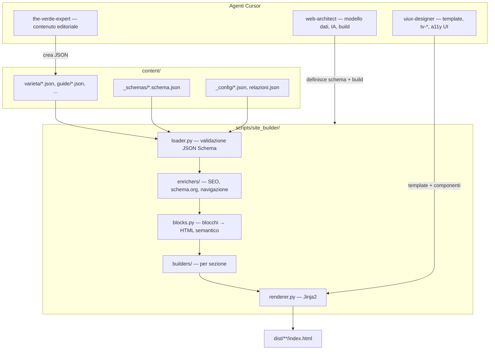
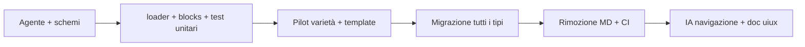

# Web Architect: architettura JSON e build testabile

## Contesto attuale

Il sito usa un generatore statico Python custom (`[scripts/build.py](scripts/build.py)`) che:

- legge ~75 file `.md` con frontmatter YAML + body Markdown
- per le **varietà**, fa parsing regex sull'HTML generato (`parse_sensory`, `parse_steps`, `parse_faq`) e poi `[scripts/html_enrich.py](scripts/html_enrich.py)` rimuove/rimonta sezioni — fragile e difficile da testare
- arricchisce SEO via `[scripts/seo.py](scripts/seo.py)` al momento del render Jinja2
- non ha test automatizzati; la validazione è manuale via `[.cursor/commands/build.md](.cursor/commands/build.md)`

Gli agenti esistenti sono **skill + rule** (non cartella `agents/`): `[the-verde-expert](.cursor/skills/the-verde-expert/SKILL.md)` (always-on) e `[uiux-designer](.cursor/skills/uiux-designer/SKILL.md)` (glob su frontend).

---

## Architettura target




### Priorità IA (incorporata nello skill Web Architect)


| Priorità | Obiettivo                        | Implementazione                                                                                                                                                   |
| -------- | -------------------------------- | ----------------------------------------------------------------------------------------------------------------------------------------------------------------- |
| 1        | Accessibilità                    | HTML semantico da blocchi strutturati; landmark, heading hierarchy, `aria-*` su componenti interattivi; test contratto a11y                                       |
| 2        | Completezza                      | JSON Schema con sezioni obbligatorie per tipo; validazione in CI                                                                                                  |
| 3        | Interattività                    | Preservare quiz, percorsi, level-toggle, filtri catalogo; blocchi `interactive_ref` dove serve                                                                    |
| 4        | Permanenza / navigazione interna | Grafo esplicito in ogni documento + `[content/relazioni.json](content/relazioni.json)`; `explore_next` calcolato e sovrascrivibile; breadcrumb + link contestuali |


---

## 1. Agente Web Architect

Creare skill e rule sul modello esistente.

**File nuovi:**


| File                                                                                               | Ruolo                                                                                        |
| -------------------------------------------------------------------------------------------------- | -------------------------------------------------------------------------------------------- |
| `[.cursor/skills/web-architect/SKILL.md](.cursor/skills/web-architect/SKILL.md)`                   | Definizione agente: IA, content model, build, test, collaborazione con uiux/the-verde-expert |
| `[.cursor/skills/web-architect/content-model.md](.cursor/skills/web-architect/content-model.md)`   | Specifica blocchi, tipi documento, campi obbligatori                                         |
| `[.cursor/skills/web-architect/ia-priorities.md](.cursor/skills/web-architect/ia-priorities.md)`   | Regole navigazione interna, grafo temi, explore_next                                         |
| `[.cursor/skills/web-architect/build-pipeline.md](.cursor/skills/web-architect/build-pipeline.md)` | Flusso build, moduli, comandi, CI                                                            |
| `[.cursor/skills/web-architect/seo-metadata.md](.cursor/skills/web-architect/seo-metadata.md)`     | schema.org, keywords, OG; cosa va nel JSON vs auto-generato                                  |
| `[.cursor/rules/web-architect.mdc](.cursor/rules/web-architect.mdc)`                               | Attivazione su `content/`**, `scripts/`**, `templates/**`, `tests/**`, `content/_schemas/**` |


**Globs rule:** `content/`**, `scripts/`**, `templates/**`, `tests/**`, `.github/workflows/**`

**Divisione responsabilità con uiux-designer:**

- **Web Architect:** JSON schema, loader, enricher SEO/navigazione, contratto dati verso template (`meta`, `blocks_html`, `navigation`, `json_ld`)
- **UI/UX Designer:** template Jinja2, componenti `tv-`*, CSS/JS, mapping blocco → markup (aggiornare `[mapping-contenuti.md](.cursor/skills/uiux-designer/mapping-contenuti.md)` da MD a JSON; correggere encoding corrotto del file)

Aggiornare `[.cursor/commands/build.md](.cursor/commands/build.md)` e `[.cursor/commands/review.md](.cursor/commands/review.md)` per includere `pytest` obbligatorio.

---

## 2. Content Document Model (JSON strutturato)

Envelope comune + body a blocchi. **Solo testo strutturato** (scelta utente): niente Markdown inline.

### Envelope (tutti i tipi)

```json
{
  "schema_version": "1.0",
  "type": "variety",
  "slug": "sencha",
  "meta": {
    "title": "Sencha — il verde quotidiano del Giappone",
    "description": "Profilo, preparazione e contesto italiano del sencha.",
    "keywords": ["sencha", "tè verde giapponese", "preparazione sencha"],
    "canonical_path": "/varieta/sencha/"
  },
  "seo": {
    "robots": "index,follow",
    "og_type": "article"
  },
  "navigation": {
    "related_slugs": ["gyokuro", "bancha"],
    "temi_kb": ["preparazione_servizio"],
    "controversie": ["caffeina-stimolazione"],
    "momenti": ["pausa"],
    "stagioni": ["primavera", "estate"],
    "percorso_tappa": "dal-bancha-al-matcha",
    "explore_next": []
  },
  "taxonomy": { },
  "body": { "blocks": [] }
}
```

### Tipi blocco (`body.blocks[]`)


| Tipo              | Uso                                             | Output HTML               |
| ----------------- | ----------------------------------------------- | ------------------------- |
| `heading`         | h1–h3 con `level`                               | `<h2>` semantico          |
| `paragraph`       | `spans[]` con `text` / `strong` / `em` / `link` | `<p>`                     |
| `list`            | `items[]`, `ordered`                            | `<ul>`/`<ol>`             |
| `sensory_profile` | aspetto, aroma, gusto, retrogusto               | `tv-sensory`              |
| `brew_params`     | temp, grammi, secondi, infusioni                | `tv-brew-card`            |
| `steps`           | passaggi preparazione                           | `tv-steps`                |
| `faq`             | domande/risposte                                | `tv-faq` + schema FAQPage |
| `callout`         | variant: `italia`, `warning`, `tip`             | `tv-callout-italia` ecc.  |
| `related_links`   | varietà/guide collegate                         | `tv-related`              |
| `level_section`   | `level: "intro"                                 | "deep"`                   |
| `positions`       | controversie (fonte KB + tesi)                  | `tv-positions`            |


### Tipi documento e schemi

Cartella `[content/_schemas/](content/_schemas/)`:

- `document.base.schema.json` — envelope comune
- `variety.schema.json`, `article.schema.json`, `glossary.schema.json`, `controversy.schema.json`, `hub.schema.json`, `page.schema.json`

Ogni file in sottocartelle mantiene il path attuale, estensione `.json`:
`content/varieta/sencha.json`, `content/glossario/umami.json`, ecc.

**Esempio sencha** (estratto — sostituisce `[content/varieta/sencha.md](content/varieta/sencha.md)`):

```json
{
  "type": "variety",
  "slug": "sencha",
  "meta": { "title": "...", "description": "...", "keywords": ["sencha", "..."] },
  "taxonomy": {
    "origine": "Giappone", "stile": "sencha", "caffeina": "Media",
    "stagione": "Primavera", "brew": { "temp": 75, "grams": 3, "seconds": 60, "infusions": "2-3" }
  },
  "body": {
    "blocks": [
      { "type": "heading", "level": 1, "spans": [{ "type": "text", "value": "Sencha" }] },
      { "type": "paragraph", "spans": [{ "type": "text", "value": "Ago verdi, profumo di erba..." }] },
      { "type": "sensory_profile", "aspetto": "...", "aroma": "...", "gusto": "...", "retrogusto": "..." },
      { "type": "steps", "items": [{ "text": "Scalda l'acqua a 75 °C", "duration": "2 min" }] },
      { "type": "callout", "variant": "italia", "spans": [...] },
      { "type": "faq", "items": [{ "question": "Sencha o gyokuro?", "answer_spans": [...] }] }
    ]
  }
}
```

---

## 3. Refactor build pipeline

Suddividere `[scripts/build.py](scripts/build.py)` (~1050 righe monolitiche) in package testabile:

```
scripts/
  build.py                    # CLI sottile (--content, --out, --validate-only)
  migrate_md_to_json.py       # migrazione one-shot (poi rimovibile)
  site_builder/
    __init__.py
    loader.py                 # glob *.json, validate jsonschema, index by type/slug
    blocks.py                 # blocks[] → HTML semantico (sostituisce markdown + html_enrich)
    renderer.py               # SiteBuilder.render, Jinja2 env
    enrichers/
      seo.py                  # sposta logica da scripts/seo.py + merge seo da JSON
      navigation.py           # explore_next, breadcrumbs, path_nav
      schema_org.py           # auto: WebPage, Article, HowTo, FAQPage, BreadcrumbList
    builders/
      variety.py, article.py, glossary.py, controversy.py, hub.py, ...
      home.py, gioca.py, diario.py, ...
    assets.py                 # da asset_pipeline.py
```

**Rimozioni dopo migrazione:**

- dipendenze `python-frontmatter`, `markdown` da `[requirements.txt](requirements.txt)`
- `[scripts/html_enrich.py](scripts/html_enrich.py)` e funzioni `parse_md`, `parse_sensory`, ecc.
- `[scripts/generate_content.py](scripts/generate_content.py)` → riscritto come `generate_content_json.py` che emette JSON strutturato

**Arricchimento SEO automatico** (`[scripts/seo.py](scripts/seo.py)` esteso):

- Se `seo.schema_org` assente nel JSON, generare da tipo + blocchi (es. varietà con `steps` → `HowTo`; `faq` → `FAQPage`)
- Merge `meta.keywords` → `<meta name="keywords">` (opzionale ma utile)
- Preservare audience Italia, `inLanguage: it-IT`, breadcrumb JSON-LD

**Template Jinja2:** cambio minimo — sostituire `{{ content_html | safe }}` con output di `blocks.py`; mantenere stessi nomi contesto dove possibile per compatibilità uiux.

---

## 4. Migrazione contenuti

Script `[scripts/migrate_md_to_json.py](scripts/migrate_md_to_json.py)`:

1. Per ogni `.md` in `content/`, parse frontmatter + sezioni H2
2. Mappa sezioni note → blocchi tipizzati (Profilo sensoriale → `sensory_profile`, ecc.)
3. Paragrafi/liste → `paragraph`/`list` con `spans` strutturati
4. Scrivi `.json` affianco, valida contro schema
5. Dopo test verdi: eliminare tutti i `.md` editoriali (~75 file)

`content/_config/` e `relazioni.json` restano invariati (già JSON).

---

## 5. Suite di test (copertura completa processo)

Nuova cartella `[tests/](tests/)` con **pytest**.

**Dipendenze aggiunte** a `requirements.txt`:

```
pytest>=8.0
jsonschema>=4.0
beautifulsoup4>=4.12   # asserzioni HTML
```


| Modulo test                    | Cosa verifica                                                                                   |
| ------------------------------ | ----------------------------------------------------------------------------------------------- |
| `test_schemas.py`              | Ogni `content/**/*.json` (escluso `_config`) valida contro schema del suo `type`                |
| `test_blocks.py`               | Ogni tipo blocco → HTML semantico atteso; heading hierarchy; link con `href`                    |
| `test_enrichers_seo.py`        | JSON-LD generato: `@context`, `@type`, FAQPage quando presente faq                              |
| `test_enrichers_navigation.py` | `explore_next` rispetta limite 4 link, include related + temi                                   |
| `test_build_integration.py`    | Build completa in tmp dir; ≥69 pagine; exit 0; `varieta/index.json` presente                    |
| `test_build_output.py`         | Campione pagine: canonical, meta description, un solo h1, landmark `main`                       |
| `test_migration_parity.py`     | Confronto snapshot HTML pre/post migrazione per 3–5 pagine chiave (sencha, umami, controversia) |


**CI** — aggiornare `[.github/workflows/deploy.yml](.github/workflows/deploy.yml)`:

```yaml
- name: Run tests
  run: pytest tests/ -q
- name: Build site
  run: python scripts/build.py --content content --out dist
```

Opzionale: workflow separato `test.yml` su PR.

**Comando locale:** `pytest` prima di ogni build/commit su content/scripts/templates.

---

## 6. Miglioramenti IA navigazione

Oltre a preservare `explore_next` e `path_nav` attuali, estendere in `[site_builder/enrichers/navigation.py](scripts/site_builder/enrichers/navigation.py)`:

- Leggere grafo `[content/relazioni.json](content/relazioni.json)` per link tematici trasversali
- Campo opzionale `navigation.explore_next` nel JSON per override editoriale
- Per glossario: auto-link a varietà correlate via `related_slugs` / temi
- Per articoli impara: link a controversie collegate dal tema KB
- Generare sezione "Continua a esplorare" con almeno 3 link interni quando il documento ne ha meno di 2 (backfill dal grafo)

---

## Ordine di implementazione consigliato




1. **Fondamenta** — skill Web Architect, schemi JSON, `loader.py`, `test_schemas.py`
2. **Renderer** — `blocks.py` + pilot su 2 varietà + `test_blocks.py`
3. **Build modulare** — estrarre builders, migrare tutte le sezioni
4. **Migrazione** — script MD→JSON, parity test, delete `.md`
5. **Pulizia** — rimuovere markdown/frontmatter/html_enrich, aggiornare generate script
6. **CI + doc** — pytest in deploy, aggiornare mapping uiux, comandi Cursor

---

## File principali toccati


| Azione   | Path                                                                                        |
| -------- | ------------------------------------------------------------------------------------------- |
| Nuovo    | `.cursor/skills/web-architect/*`, `.cursor/rules/web-architect.mdc`                         |
| Nuovo    | `content/_schemas/*.schema.json`, `content/**/*.json`                                       |
| Nuovo    | `scripts/site_builder/`**, `tests/`**                                                       |
| Refactor | `scripts/build.py`, `scripts/seo.py` → package enrichers                                    |
| Aggiorna | `templates/*.html` (minimo), `requirements.txt`, `.github/workflows/deploy.yml`             |
| Aggiorna | `.cursor/skills/uiux-designer/mapping-contenuti.md`, `.cursor/commands/build.md`            |
| Elimina  | ~75 `content/**/*.md`, `scripts/html_enrich.py`, `scripts/generate_content.py` (sostituito) |


**Non in scope:** `books/knowledge-base.json` resta fonte editoriale per the-verde-expert, separata dal build.