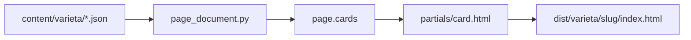

# Mapping contenuti — the-verde.it

Traduzione da **JSON strutturato** (`content/`) → **PageDocument** → HTML statico.

Formati allineati a [the-verde-expert](../the-verde-expert/SKILL.md) e [rendering-json-html.md](rendering-json-html.md).

---

## Flusso

---

## PageDocument → UI

| PageDocument | Template |
|--------------|----------|
| `page.cards[]` | loop in `variety.html` / `article.html` |
| `card.id` | `#anchor`, classe `tv-card--{id}` |
| `card.body.type` | router in `partials/card-body.html` |
| `page.schema` | JSON-LD `@graph` in head |
| `page.navigation.exploreNext` | aside explore |

---

## Card body → componente

| `body.type` | Componente |
|-------------|--------------|
| `prose` | `partials/prose.html` |
| `metrics` | `partials/metrics.html` → `tv-brew-card` |
| `sensory` | `partials/sensory.html` |
| `list` | lista `tv-prose__list` |
| `howTo` | `partials/steps.html` → `tv-step-list` |
| `faq` | `partials/faq.html` → `tv-faq` |
| `related` | `partials/related.html` |
| `positions` | `partials/positions.html` |

---

## Collaborazione agenti

- **web-architect**: JSON schema, PageDocument, build, test — [uiux-handoff.md](../web-architect/uiux-handoff.md)
- **uiux-designer**: template, CSS app shell, ordine card
- **the-verde-expert**: contenuto in `body.blocks`

Ordine card varietà: `brief → brew → sensory → gear → steps → errors → italy → pairings → faq → related`
