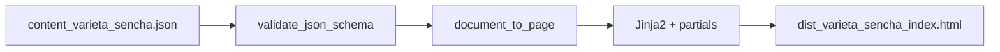

# Rendering JSON → HTML — the-verde.it

Pipeline **uniforme**: content JSON → **PageDocument** → template Jinja2 + partials.

**Vietato:** concatenare HTML nel build script. **Obbligatorio:** `PageDocument` → `partials/*.html`.

---

## Flusso build

1. **Validate** — `content/_schemas/{type}.schema.json`
2. **Transform** — `site_builder/page_document.py` → `cards[]` + `schema.@graph`
3. **Render** — `variety.html` + `partials/card.html` + `partials/prose.html`
4. **Emit** — JSON-LD da `page.schema` (testo visibile = structured data)

---

## PageDocument

Vedi [web-architect/uiux-handoff.md](../web-architect/uiux-handoff.md).

Tipi `type`: `variety` | `article` | `glossary` | `controversy` | `hub` | `page`

---

## Template e partials

| File | Ruolo |
|------|-------|
| `templates/base.html` | App shell, bottom nav, schema_blocks |
| `templates/variety.html` | Hero + card feed |
| `templates/article.html` | Card feed o body legacy |
| `templates/partials/card.html` | Wrapper `tv-card` |
| `templates/partials/card-body.html` | Router per tipo body |
| `templates/partials/prose.html` | Prosa uniforme `tv-prose__*` |
| `templates/partials/metrics.html` | Brew card |
| `templates/partials/steps.html` | HowTo + microdata |
| `templates/partials/faq.html` | FAQ semantiche |

### Ordine card — `variety.html`

1. `brief` — In breve
2. `brew` — Metriche preparazione
3. `sensory` — Profilo sensoriale
4. `gear` — Attrezzatura
5. `steps` — Passaggi (HowTo)
6. `errors` — Errori comuni
7. `italy` — In Italia
8. `pairings` — Abbinamenti
9. `faq` — FAQ
10. `related` — Varietà simili

---

## Mappa blocco JSON → card

| `body.blocks[].type` | `cards[].id` | `body.type` |
|----------------------|--------------|-------------|
| `paragraph` (lead) | `brief` | `prose` |
| `brew_params` | `brew` | `metrics` |
| `sensory_profile` | `sensory` | `sensory` |
| `equipment` | `gear` | `list` |
| `steps` | `steps` | `howTo` |
| `errors` | `errors` | `list` |
| `callout` italia | `italy` | `prose` |
| `pairings` | `pairings` | `list` |
| `faq` | `faq` | `faq` |
| `related_links` | `related` | `related` |
| `level_section` intro/deep | `intro` / `deep` | `prose` |
| `positions` | `positions` | `positions` |

---

## Schema.org

`page.schema.@graph` generato in build — un unico `<script type="application/ld+json">` in head.

FAQ e HowTo: markup HTML in partials allineato al grafo (stesso testo).

---

## Checklist uniformità

- [ ] Ogni tipo pagina = template Jinja2 dedicato
- [ ] Prosa solo via `partials/prose.html`
- [ ] PageDocument validato (content schema + test pytest)
- [ ] Stesso ordine DOM card per tipo
- [ ] JSON-LD da `page.schema`, non hardcoded nel template
- [ ] Card feed + bottom nav su mobile (app-shell.md)
