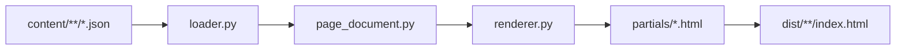

# Build pipeline — the-verde.it

## Architettura (Web Architect + UI/UX Designer)



1. **Content JSON** — envelope + `body.blocks` (the-verde-expert)
2. **Validazione** — `content/_schemas/*.schema.json`
3. **PageDocument** — `blocks` → `cards[]` ordinate (uiux-designer)
4. **Schema @graph** — single source of truth JSON-LD
5. **TemplateRenderer** — Jinja2 + partials (`prose`, `card`, `metrics`, …)
6. **Builders** — moduli per sezione (`builders/variety.py`, …)

## Comandi

```bash
pip install -r requirements.txt
python -m pytest tests/ -q
python scripts/build.py --content content --out dist
python scripts/build.py --validate-only
```

## Struttura moduli

```
scripts/site_builder/
  loader.py           # carica + valida JSON sorgente
  page_document.py    # PageDocument + cards + @graph
  blocks.py           # fallback legacy body HTML
  document.py         # meta normalizzato
  renderer.py         # TemplateRenderer
  builder.py          # SiteBuilder orchestrator
  builders/
    variety.py        # catalogo + schede varietà
  enrichers/
    navigation.py
    schema_org.py
    seo_context.py
    _seo_core.py
```

## Template

```
templates/
  base.html           # app shell + bottom nav
  variety.html        # card feed
  article.html        # card feed o legacy body
  partials/
    card.html
    card-body.html
    prose.html
    metrics.html, sensory.html, steps.html, faq.html, ...
```

## Handoff agenti

| Agente | Output verso build |
|--------|-------------------|
| the-verde-expert | `content/**/*.json` con blocchi strutturati |
| web-architect | schemi, PageDocument, enricher, test |
| uiux-designer | template, partials, CSS `tv-*`, ordine card |

Vedi [uiux-handoff.md](uiux-handoff.md).
